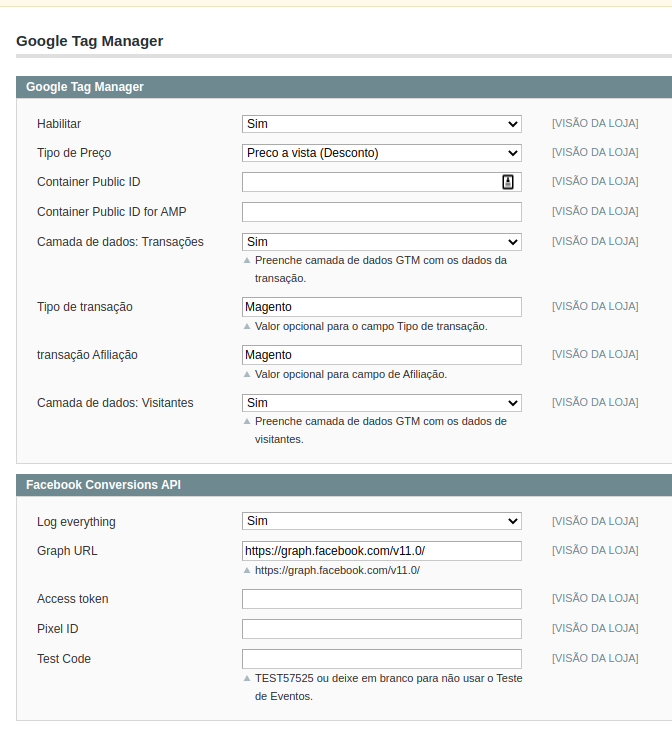
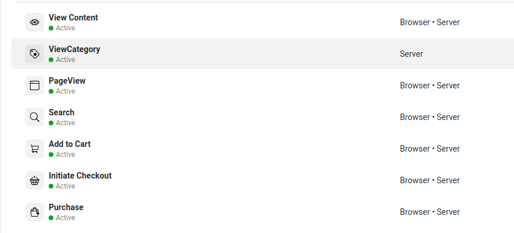

# googletagmanagerAndConversionsapi
Module to provide DataLayer with enhanced ecommerce information to Google Tag Manager and send backend requests do Facebook Conversions API

Supported Magento version 1.9 >

Admin config

Conversions Requests

Simple module to popular datalayer for advanced ecommerce and also send requests to conversions api.

I don't provide support for the module.
